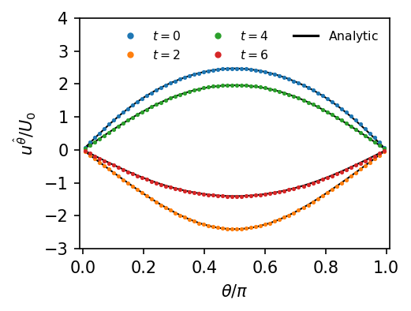

# Vielbein Lattice Boltzmann Method for Fluid Flows on Spherical Surfaces

This repository provides a simplified python implementation of the numerical method
introduced in [arxiv.org/abs/2504.15574](https://arxiv.org/abs/2504.15574)), which 
develops a lattice Boltzmann scheme based on the vielbein formalism for the study of fluid flows on spherical surfaces.  

We provide two implementations:
- `vlbm.py` - Plain Python implementation (pedagogical)
- `vlbm_numba.py` - Numba-accelerated implementation (up to ~100x faster)

```bibtex
@article{ambrus2025vielbein,
  title={Vielbein Lattice Boltzmann approach for fluid flows on spherical surfaces},
  author={Ambrus, Victor E and Bellantoni, Elisa and Busuioc, Sergiu and Gabbana, Alessandro and Toschi, Federico},
  journal={arXiv preprint arXiv:2504.15574},
  year={2025}
}
```

## Installation

### Requirements

- Python 3.7+
- `numpy`
- `matplotlib`
- `scipy`
- `argparse`
- `tqdm`
- `glob`
- `numba` (for the accelerated version)

### Setup

```bash
pip install numpy matplotlib scipy argparse tqdm glob numba
```

## Usage

### Basic Simulation

Run the default configuration:

```bash
python vlbm.py
```

### Custom Parameters

All simulation parameters can be configured via command-line arguments:

```bash
python vlbm.py --lx 4 --ly 32 --q-order 4 --nsteps 6000 \
    --dump-interval 1000 --key-init 1 --ampl 1e-5 --rho-zero 1.0 \
    --dt 1e-3 --tau 1e-2 --R 1.0 --dump-dir output --verbose
```

**Available parameters:**

| Parameter | Type | Default | Description |
|-----------|------|---------|-------------|
| `--lx` | int | 4 | Domain size in azimuthal direction |
| `--ly` | int | 32 | Domain size in polar direction |
| `--q-order` | int | 4 | Quadrature order (3 or 4) |
| `--nsteps` | int | 1000 | Number of time steps |
| `--dump-interval` | int | 100 | Output frequency (steps) |
| `--key-init` | int | 1 | Initial condition: 1=sound wave, 2=shear wave |
| `--ampl` | float | 1e-5 | Initial velocity amplitude |
| `--rho-zero` | float | 1.0 | Background density |
| `--dt` | float | 1e-3 | Time step |
| `--tau` | float | 1e-2 | Relaxation time |
| `--R` | float | 1.0 | Sphere radius |
| `--dump-dir` | str | output | Output directory for results |

## Benchmarks

We provide two benchmark test cases with analytical solutions for validation.

### Sound Wave



Axisymmetric longitudinal wave propagating on the sphere with initial velocity profile:

$$
u^{\hat{\theta}}(\theta) = U_0 (\pi - \theta) \theta
$$

#### Run

**Plain Python (only fast for small grids):**
```bash
python vlbm.py
python plot_sound_wave.py
```

**Numba (recommended):**
```bash
python vlbm_numba.py --lx 2 --ly 64 --key-init 1 --nsteps 6000 --dump-interval 2000 --dump-dir sound_wave
python plot_sound_wave.py --times 0 2000 4000 6000 --dump-dir sound_wave
```

### Shear Wave


Axisymmetric azimuthal (transverse) wave with constant initial velocity:

$$
u^{\hat{\varphi}}(\theta) = V_0
$$

#### Run

```bash
python vlbm_numba.py --lx 2 --ly 64 --key-init 2 --nsteps 50000 --dump-interval 5000 --dump-dir shear_wave
python plot_shear_wave.py --times 0 5000 10000 50000 --dump-dir shear_wave
```


## Plotting Results

### Sound Wave Profile

```bash
python plot_sound_wave.py --dump-dir output --times 0 1000 2000 3000 --output sound_wave.pdf
```

### Shear Wave Profile

```bash
python plot_shear_wave.py --dump-dir output --times 0 5000 10000 50000  --output shear_wave.pdf
```

**Plotting parameters:**

| Parameter | Type | Default | Description |
|-----------|------|---------|-------------|
| `--dump-dir` | str | ./output/ | Directory containing simulation output |
| `--times` | int list | 0 200 400 1000 | Iteration numbers to plot |
| `--output` | str | sound_wave_velocity_profile.pdf | Output filename |

## File Structure

```
.
├── vlbm.py                      # Plain Python implementation
├── vlbm_numba.py                # Numba-accelerated implementation
├── plot_sound_wave.py           # Plotting script for sound wave
├── plot_shear_wave.py           # Plotting script for shear wave
├── utils.py                     # Utility functions and analytical solutions
├── output/                      # Default output directory
└── README.md
```

## Implementation Details

### Coordinate System

The code uses spherical coordinates $(\varphi, \theta)$ where:
- $\varphi$ is the azimuthal angle (0 to $2\pi$)
- $\theta$ is the polar angle (0 to $\pi$)
- $R$ is the sphere radius

### Discretization

- **Spatial**: Finite difference upwind scheme (2nd order)
- **Temporal**: Runge-Kutta 3rd order integration
- **LBM Models**: D2Q9 (q-order=3) or D2Q16 (q-order=4) quadrature

### Boundary Conditions

- Periodic in azimuthal direction ($\varphi$)
- Bounce-back in polar direction ($\theta$)


## License

This code is provided as-is for educational and research purposes.